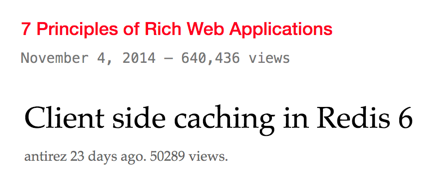

# pageviews-microservice

A simple microservice for counting page views and embedding them in your site.

It's inspired by [antirez.com](http://antirez.com) & [rauchg.com](https://rauchg.com/).

## Environment Variables

### API_KEY

Type: `string`  
Default: `undefined`

When you provide it, all request to need to be authenticated in order to increment pageviews.

The API key can be provided:

- as `x-api-key` request header.
- as `key` or `apiKey` as query parameter.

You can use [randomkeygen.com](https://randomkeygen.com) for generating an unique API key.

### DB_URI

Type: `string`  
Default: `undefined`

The database URI used for backed your microservice.

Since we delegate into [`Keyv`](https://github.com/lukechilds/keyv), any storage (Redis, Mongo, SQLite, PostgreSQL, MySQL & more) are supported.

## License

**pageviews-microservice** © [Kiko Beats](https://kikobeats.com), released under the [MIT](https://github.com/Kikobeats/pageviews-microservice/blob/master/LICENSE.md) License. 
Authored and maintained by Kiko Beats with help from [contributors](https://github.com/Kikobeats/pageviews-microservice/contributors).

> [kikobeats.com](https://kikobeats.com) · GitHub [Kiko Beats](https://github.com/Kikobeats) · Twitter [@Kikobeats](https://twitter.com/Kikobeats)
